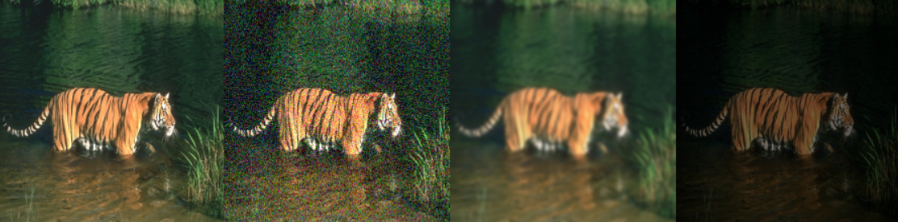
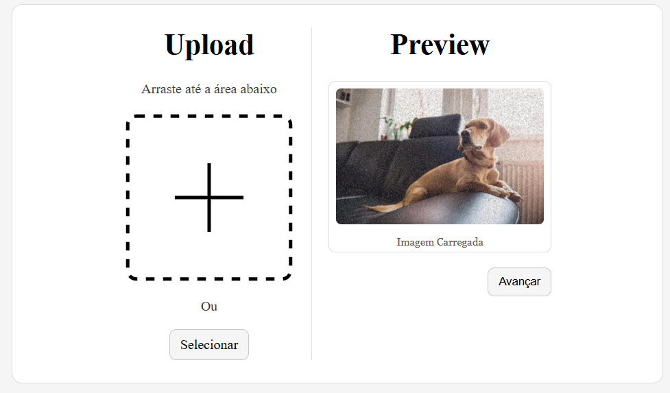
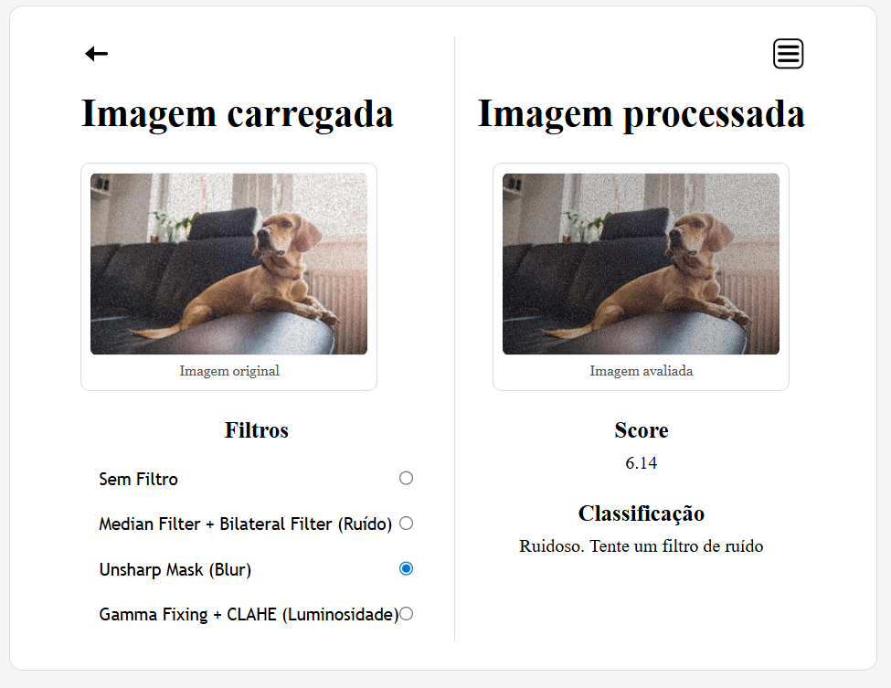
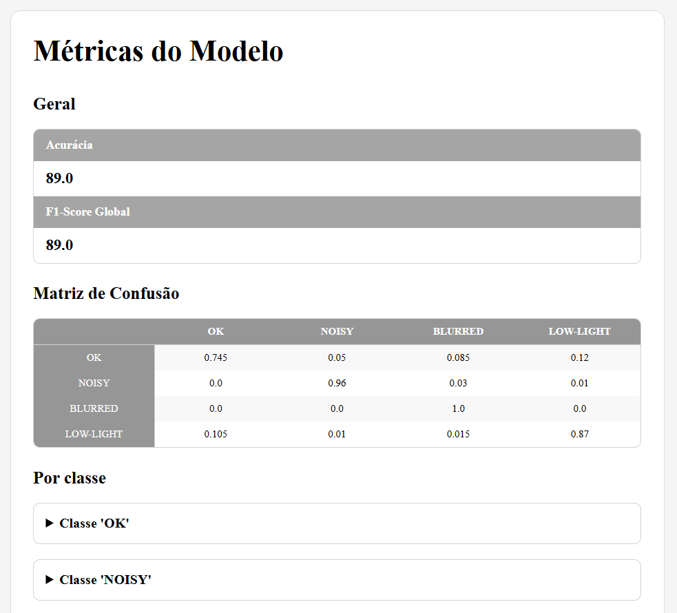

# Ferramenta de ensaio de classificação de distorções em imagens

> Ferramenta experimental de criação de base de dados sintética de imagens distorcidas, treinamento de modelo CNN para classificação de distorções e visualização dos resultados por meio de uma aplicação web.

Este projeto implementa um sistema para ensaio de classificação de distorções em imagens utilizando uma base de dados sintética. A classificação é realizada por meio de um modelo CNN customizável. Adicionalmente, o sistema conta com uma interface web para avaliar uma dada imagem de entrada, apresentar um *score* associado à classificação e exibir opções de filtros clássicos associados a cada tipo de distorção.

O principal objetivo do projeto é gerar uma base de dados sintética e avaliar como uma rede treinada com esses dados simples se comporta quando confrontada com imagens reais. A interface web foi projetada para permitir o acesso ao sistema a partir de diferentes origens dentro da mesma rede, bem como apresentar os dados de classificação e exemplos de processamento de forma simples e interpretável.

## 🔍 Visão Geral

A base de dados utilizada para o treinamento do modelo é baseada na [BSDS500](https://www2.eecs.berkeley.edu/Research/Projects/CS/vision/bsds/), com pré-processamentos adicionais para simular distorções de ruído, baixa luminosidade e *blur*.

A arquitetura do modelo CNN utiliza a técnica de *transfer learning*, tendo como *backbone* a EfficientNetB0. O treinamento é realizado com *early stopping* como uma tentativa de mitigar o *overfitting*, comum em arquiteturas mais profundas.

A interface web desenvolvida permite realizar o upload de uma imagem para o servidor e executar sua avaliação pelo modelo treinado. O sistema apresenta a classe estimada, um *score* associado à predição e um conjunto de filtros clássicos comumente relacionados ao tipo de distorção detectada.

Quanto ao processo de filtragem, o escopo atual do projeto contempla apenas a aplicação de um conjunto restrito de filtros clássicos, sem ajuste fino manual ou automático de parâmetros. Esses filtros possuem caráter demonstrativo e ilustrativo, não sendo garantida a reversão das degradações presentes na imagem.

## ▶️ Como executar 
### 1. Clone o repositório
```bash
git clone https://github.com/pedro123k/img-filter-hint.git  
cd img-filter-hint
``` 
### 2. Crie um ambiente virtual
```bash
python -m venv ./venv
source .venv/bin/activate # Linux / Mac
# ou
.\.venv\Scripts\activate # Windows
```

### 3. Instale as dependências 
```bash
pip install -r requirements.txt
```

### 4. Execute o script 
```bash
python main.py 
```

### Parâmetros adicionais
```bash
--no-training # Pula a etapa de treinamento (Não utilizar se não há nenhum modelo salvo ainda)
```

## 📁 Estrutura do Projeto

```text
.
├── app/            # Implementação da interface web
├── model/          # Arquivo do modelo treinado
├── results/        # Arquivos contendo métricas de desempenho do modelo
├── scripts/        # Script auxiliar para treinamento e avaliação
├── src/            # Código-fonte do modelo e da base de dados
├── main.py         # Ponto de entrada do sistema
├── requirements.txt
├── README.md
└── .gitignore
```

## 📸 Screenshots do Projeto





## 🚧 Status do Projeto

Projeto finalizado no escopo experimental proposto.  
Possíveis extensões futuras incluem a exploração de estratégias mais avançadas de geração de dadosnão contempladas neste trabalho.